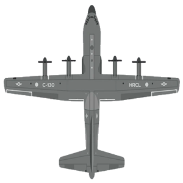
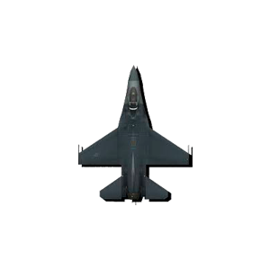
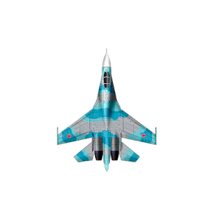

# Alien Invasion

Mobile arcade game for android/ios

## Screenshots

<table>
	<tr>
		<td></td>
		<td></td>
		<td></td>
		<td></td>
	</tr>
</table>

## Manual Tests videos


## App Functionality

Alien Invasion is a mobile arcade game where the player controls the ship and destroys aliens.

Main gameplay features:

- Real-time ship interaction with physics-based movement
- Progressive difficulty with faster gameplay and more dangerous enemy patterns
- Multiple visual game assets (ships, enemies, fields, trees, houses, clouds, game over screens)
- Sound effects and in-game audio feedback
- Localized UI and onboarding flow for new players
- Game over state with clear result feedback and restart loop

## Architecture and Design

The app follows a layered Flutter structure with feature separation under the `lib/app` directory.

Architecture overview:

- **Presentation layer**: screens and widgets in `lib/app/screens` and `lib/app/widgets`
- **State management layer**: BLoC logic in `lib/app/bloc` for predictable event/state flow
- **Domain/data layer**: models and repositories in `lib/app/models` and `lib/app/repositories`
- **Infrastructure layer**: services in `lib/app/services` and navigation in `lib/app/router`
- **Design system**: shared tokens and constants in `lib/app_design` (colors, dimensions, durations, layout, audio)

Design principles:

- Fast and responsive gameplay-first UX
- Consistent visual style via centralized design constants
- Maintainable modular code with clear folder boundaries
- Cross-platform support for Android and iOS from a single Flutter codebase

## CI (Continuous Integration)

This project includes CI automation to ensure code quality by running tests before pushing to git.

### Option 1: Local CI Script (Windows - PowerShell)

Run the local CI process using the provided PowerShell script:

```powershell
.\ci.ps1
```

Or with a custom commit message:

```powershell
.\ci.ps1 -CommitMessage "Your custom message"
```

The script will perform:

- Run all unit and widget tests with 'flutter test'
- Abort execution if any tests fail, with an error message
- Check for uncommitted changes
- Commit all changes with the specified message
- Push to the remote git repository

### Option 2: The same, but with a check that the project builds before push

```powershell
.\ci-build.ps1
```

Or with a custom commit message:

```powershell
.\ci-build.ps1 -CommitMessage "Your custom message"
```
